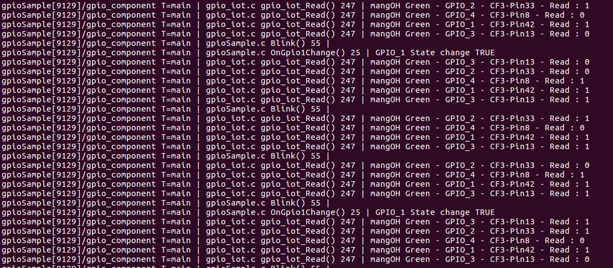

Legato Helper Lib to Drive CF3-GPIOs on mangOH's IoT card
=========================================================

[IoT Expansion Card](https://mangoh.io/iot-cards) can be plugged into [mangOH boards](https://mangoh.io) (Green or Red) to provide new features and interfaces.

This helper library faciliates your Sierra Wireless Legato-based module (e.g. WPx85, WP76xx...) to seamlessly drive CF3-GPIOs that are wired to IoT expansion card (slot 0). Your Legato application can be reused on mangOH Red or mangOH Green without having to change the code and the wiring on IoT card.

The following table lists where CF3 modules (e.g. WP85, WP76) pins exposed by the GPIO service are connected on mangOH Red and mangOH Green:

| Legato GPIO Service | CF3 Pin | IoT0 on mangOH Red | IoT0 on mangOH Green |
| ------------------- | ------- | ------------------ | -------------------- |
| le_gpioPin42 | 42 | IoT0 GPIO_1 (pin 24) | IoT0 GPIO_1 (pin 24) |
| le_gpioPin33 | 33 | *IoT0 card detect* | IoT0 GPIO_2 (pin 25) |
| le_gpioPin13 | 13 | IoT0 GPIO_2 (pin 25) | IoT0 GPIO_3 (pin 26) |
| le_gpioPin7 | 7 | IoT0 GPIO_3 (pin 26) | *IoT1 GPIO_2 (pin 25)* |
| le_gpioPin8 | 8 | IoT0 GPIO_4 (pin 27) | IoT0 GPIO_4 (pin 27) |

Depending on the type of target mangOH board, this lib wraps to the proper underlying le_gpioPinxx service. Your app only needs to care about the IoT0 GPIO-Pin to be addressed, and doesn't need to worry about the actual CF3-Pin to be programmed.

For instance, to read the ouput of GPIO_2 on IoT card slot 0:
- Without using this helper lib
	- on mangOH Green : le_gpioPin33_Read()
	- on mangOH Red : le_gpioPin13_Read()
- Using this helper
	- for both mangOH Green and Red : gpio_iot_Read(2)

Sample
------
gpioSample, is a simple app making using of this helper to:
- alternatively blink 2 LEDS that are connected to IoT0's GPIO_2 (pin 25) & GPIO_4 (pin 27)
- use a switch (push button) connected to GPIO_1 (pin 24) to toggle another LED/motor on GPIO_3 (pin 26)

Note: Use transistor to drive LED/motor.

Target mangOH board
-------------------
The type of mangOH board (Green or Red) can be set using Config Tree as follow:

	config get /gpio_iot

	config set /gpio_iot/mangohType <boardType> int

		where <boardType> is 0=Red, 1=Green

Testing
-------

Compile and install the app
	make wp76xx
	app install gpioSample.wp76xx.update 192.168.2.2

Legato log:

